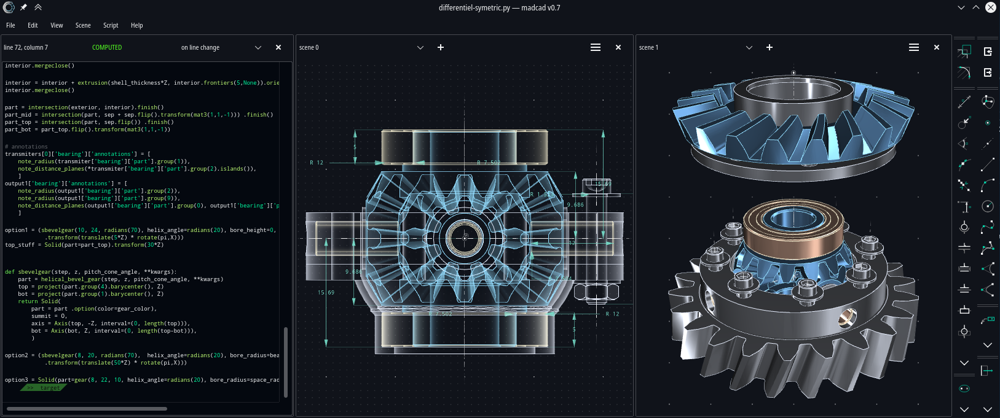
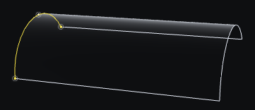
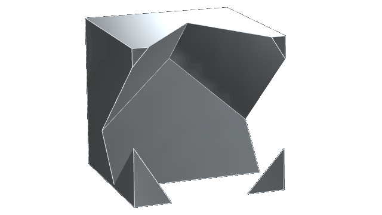
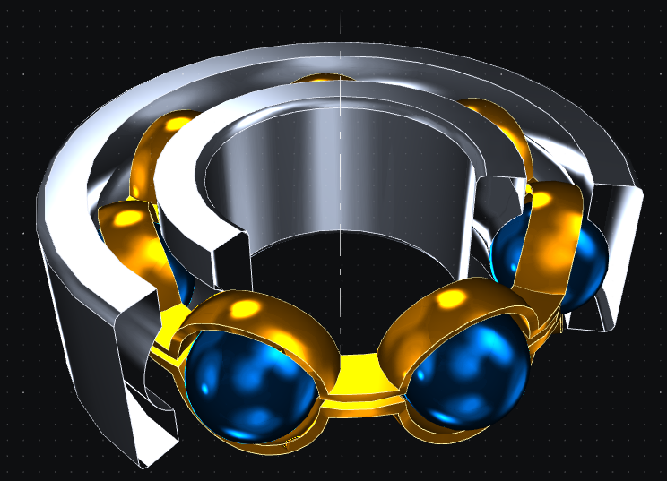

# PyMADCAD

**Mechanical design as code** -- a Python CAD library for engineers who prefer scripts and automation over clicks.

[](https://pypi.org/project/pymadcad/)
[](https://github.com/jimy-byerley/pymadcad/actions/workflows/tests.yml)
[](https://pymadcad.readthedocs.io/)
[](https://matrix.to/#/#madcad:matrix.org)

PyMADCAD is a script-based CAD library where **the Python script is the model**. Design mechanical parts with transparent, composable geometry you can version, diff, test, and automate -- no parametric black box, no opaque GUI. It outputs triangulated meshes ready for rendering, simulation, or 3D printing.

[uimadcad](https://madcad.netlify.app/uimadcad) is the graphical frontend for pymadcad -- an interactive 3D editor with multi-view scene, script editor, and quick primitive tools. Everything you can do in the GUI, you can also do in a script.

[Website](https://madcad.netlify.app) ·
[Documentation](https://pymadcad.readthedocs.io/) ·
[Examples](examples/) ·
[Matrix chat](https://matrix.to/#/#madcad:matrix.org)



## Install

```bash
pip install pymadcad
```

Optional file format support:

```bash
pip install pymadcad[stl,ply,obj]
```

## Quick examples

### Extrusion

```python
from madcad import *

show(extrusion(ArcThrough(+Y, Z, -Y), 2*X))
```



### Boolean difference

```python
from madcad import *

m1 = brick(width=vec3(2))
m2 = m1.transform(vec3(0.5, 0.3, 0.4)).transform(quat(0.7 * vec3(1, 1, 0)))

show([difference(m1, m2)])
```



See the [examples/](examples/) folder and the [guide](https://pymadcad.readthedocs.io/en/latest/guide/overview.html) for more.



## Features

- **Surface generation** -- extrusion, revolution, tube, helix, screw, saddle, and standard shapes
- **Boolean operations** -- union, intersection, difference with spatial hashing
- **Kinematic system** -- joints, screw theory, mechanism simulation
- **Constraint solver** -- tangent, distance, angle, radius, and more
- **Bevel & blending** -- chamfer, filet, and smooth transitions
- **Standard library** -- ISO nuts, screws, bearings, gears
- **File I/O** -- STL, PLY, OBJ import/export
- **High-quality display** -- OpenGL rendering via moderngl, Qt integration

## Project structure

```
pymadcad/
├── madcad/      # Python module
├── src/         # Rust extensions for the python module (performance-critical operations)
├── examples/    # example of mechanisms designed with madcad
├── tests/       # all unit tests for madcad
└── docs/        # docs based on mkdocs
```

This python module stands as a library proposing few data structures and a lot of functions to operate them. It is mostly functional and straight forward code style
The rust extension of pymadcad standard as `madcad.core` and is based on [pyo3](https://pyo3.rs/v0.28.2/) and built with [maturin](https://www.maturin.rs/)

## Development

Here are recommended ways to work with this repo

- start by cloning the repo and setting up an environment

```bash
# clone this repository from official sources
git clone https://github.com/jimy-byerley/pymadcad
cd pymadcad

# Install dependencies
uv sync
```

- build and test commands

```bash
# build the Rust extension for inplace use of madcad, add --release for bechmarks
maturin develop

# Run tests
pytest
# run tests but skip visual checks
MADCAD_VISUALCHECK=false pytest

# Build and serve the docs locally
mkdocs serve
```

- package build

```bash
# build pymadcad package
maturin build --release
# just build the docs website
mkdocs build
```

## License   

Copyright 2019-2026 Yves Dejonghe <jimy.byerley@gmail.com>

Distributed under the [LGPL-v3](LICENSE) license.
