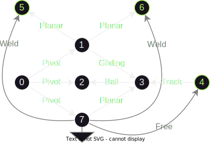

# a general kinematic solver

$$
\def\norm#1{\left\| #1 \right\|}
\def\mat#1{\begin{pmatrix} #1 \end{pmatrix}}
\def\d[#1]#2#3{{d^{#1} #3 \over {d #2} ^{#1}}}
\def\p[#1]#2#3{{\partial^{#1} #3 \over {\partial #2} ^{#1}}}
\def\sys#1{\left\{\begin{array}{ll} #1 \end{array}\right.}
$$

A kinematic is usually defined by a graph of joints linking solids, every joint is then joining exactly two solids. This is a strong assumption we wake here

a kinematic ends up being a graph where nodes are solids and links are joints

Each joint is constraining the relative movement of its solids, meaning defining joints is an implicit way to define possible movements of solids instead of providing an explicit expression of their position. This often requires a solver to compute solids positions

Classical kinematic problems are:

- 1 - determine all joints coordinates  $Q$ from given (possibly partial) solids pose matrices $S$
- 2 - determine all solids pose matrices $S \in M_{4,4}(\R)^s$ from given (possibly minimal set) joints coordinates $Q \in R^d$ 
- 3 - determine all solids velocity screws $V \in \R^{3 \times 2}$ from given (possibly minimal set) joints coordinates and their derivatives

two ways to set the problem:

- giving position variables to each solid and using joints to provide constraints relations
- giving position variables to each joint and using solids to provide constraints relations

while the first option is closer to the physical nature of the problem, it leads to a lot more scalar parameters in the problem and a lot more constraints to satisfy than the second when joints do not have a high degree of freedom (this is the usual case). The first option also raises the problem of rotation modulos, creating numeric instabilities and discontiguities in solivng.

This solver algorithms uses the second approach:

- each joint $k$ is providing a (direct transform) function expressing the relative position of its solids $(i,j)$ in term of joint parameters
  $$
  T_k:\R^{d_k} \rightarrow M^4(\R) \\
  T_k(q_k) = S_i S_j^{-1}
  $$

- the direct transform function can be derived

Direct consequences are:

- given all solids positions, inverting the joint transforms gives all joint values, so we solve problem 1 if we can have all solids poses
- given one known solid position and velocity (that solid is called *ground*) and all joint position and velocity values, a propagation through the graph allows to compute all solids positions $S$ and all solids velocities $V$. So we solve problem 2 and 3 if we can have all joints position values and all joints velocity values

## kinematic chain

Because the graph is linear, the propagation of direct transforms is a simple product

- for positions, the matrix is

$$
S_n = \prod_{i<n} T_i(q_i)
$$

- for velocities, the matrix derivative is

$$
\p[]{q_j}{S_n} = (\prod_{0<i<j} T_i(q_i)) ~\p[]{q_n}{T_n} (q_i)~ (\prod_{j<i<n}T_i(q_i))
$$

The velocity screw can be extracted from it

- derivative of constant part of homogeneous matrix is the velocity resulting
- derivative of linear part of matrix is the pre-cross-product matrix of the momentum velocity

### Note

- a kinematic chain doesn't need solving for direct transformation
- a kinematic chain has two ending solids and we just defined its direct transformation and derivatives, so it is strictly equivalent to a joint acheiving the same relative movements between its end solids

## kinematic tree

In a kinematic tree (and kinematic chain as a special case), there exist only one path from the ground to each solid, so any joints values are consistent so no need for solving in direct transformation 

## kinematic loops

### satisfying joint conditions

At contrary to kinematic chains, joint constraints in general kinematic are not satisfied for all joint values

for any kinematic loop $k$ with joints transforms $(T_k,i)$ 
$$
\text{joint constraints satisfied} \iff \text{kinematic loops closed} \\
\iff \forall n, ~~ I_4 = \prod_{0<i<n} T_{k,i}(q_i) = l_k
$$
this solver uses a Newton method to that condition on all loops
$$
l_k(Q_{i+1}) = l_k(Q_i) + \p[]Q{l_k}(Q_i) (Q_{i+1} - Q_i) + o(Q_{i+1} - Q_i) \\
\p[]{q_j}{l_k} = (\prod_{0<i<j} k_i(q_i)) ~\p[]{q_i} k_i(q_i)~ (\prod_{j<i<n}k_i(q_i))
$$

### getting solids poses

Just like for kinematic chains, propagating transformations from a known solid pose (called *ground*) gives all solids poses. The difference is that this requires graph traversal here

