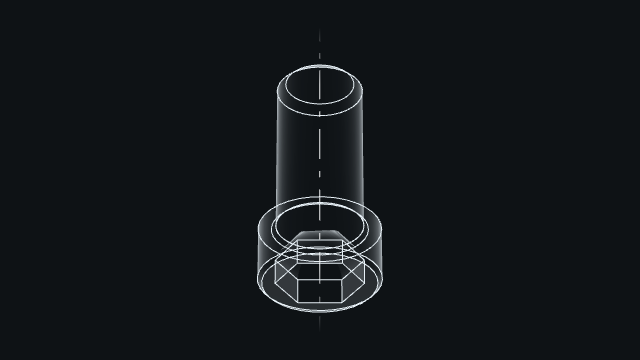
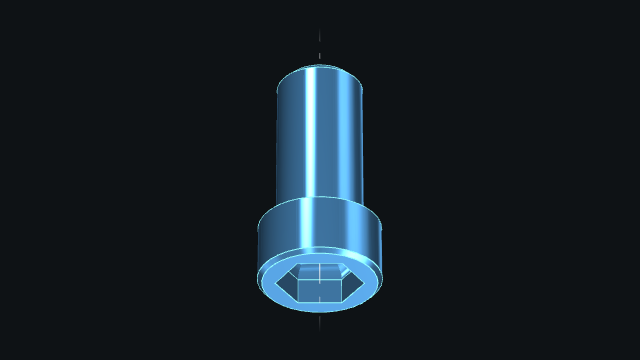

# Display

To display a `Mesh`:

## Without any option

```python
from madcad import *

m = screw(10, 20)
show([m])
```


## With triangles

```python
from madcad import *

m = screw(10, 20)
show([m], options={"display_wire":True})
```


## With transparency

```python
from madcad import *

m = screw(10, 20)
show([m], options={"display_faces":False})
```



## With points

```python
from madcad import *

m = screw(10, 20)
show([m], options={"display_points":True})
```


## Color

```python
from madcad import *

m = screw(10, 20)
# m["part"] is a `Mesh`
m["part"].option(color=vec3(70, 130, 180) / 255) # RGB
show([m])
```



!!! note
    `screw` returns a `Solid`. `Solid` does not have the method `.option()`.

To get more information, please refer to [rendering](../reference/rendering.md).
