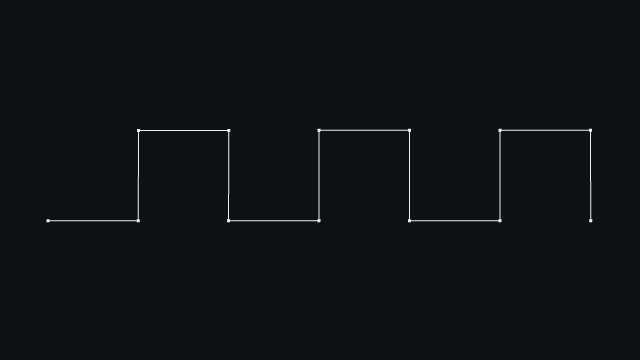
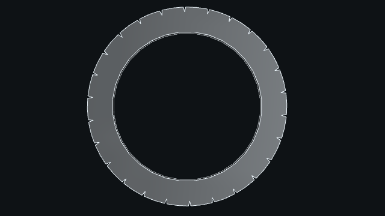

# Generation

Most of the common surfaces are generated from an outline (closed is often not mandatory). An outline can be a `Web` or a `Wire`, depending on the algorithm behind. Those can be created by hand or obtained from primitives (see above).

Generally speaking, generation functions are all functions that can produce a mesh from simple parameters by knowing by advance where each point will be.
Most generation functions produce a surface. To represent a volume we use a closed surface so you have to pay attention to if your input outline is well closed too.

The most common functions are

* extrusion
* revolution
* thicken
* tube
* saddle
* flatsurface
* repeat

Some of them are presented here. For more details, see [generation](../reference/generation.md).

## Extrusion

```python
from madcad import *
ext_circle = Circle((O, Z), 10)
int_circle = Circle((O, Z), 5)
# Create outline for extrusion to get the lateral surface
profile = web(ext_circle) + web(int_circle).flip() # .flip() to make a hole
# Create top and bottom surface
head = flatsurface(profile)
bottom = head.flip() # .flip() to reverse bright and dark surface
head = head.transform(10 * (Z + 0.2 * Y))
# Generate extrusion of `profile` with the direction `10 * (Z + 0.2 * Y)`
m = extrusion(10 * (Z + 0.2 * Y), profile) + head + bottom
show([m])
```


!!! note
    Another way to get this result and to avoid creating `head` and `bottom`, is to replace `profile` by `profile = flatsurface(web(ext_circle) + web(int_circle).flip()).flip()`.

## Revolution

```python
from madcad import *
# Create a section
points = [O, X, X + Z, 2 * X + Z, 2 * (X + Z), X + 2 * Z, X + 5 * Z, 5 * Z]
section = Wire(points).segmented().flip()
# Create a revolution of `section` with the angle `2 * pi` around the axis `(O, Z)`
rev = revolution(2 * pi, (O, Z), section)
rev.mergeclose()
show([rev])
```

!!! tip
    The function `radians` allows to convert `degrees` to `radians`.

!!! note
    If your section is closed, then create a `Wire` with your consecutive set of points and apply the method `.closed()`.
    Avoid doing for instance `points = [A, B, C, D, A]` else you will encounter troubles if you forget `.mergeclose()` somewhere.


## Repeat - Translation

```python
from madcad import *
w = Wire([Y, X + Y, X + 2 * Y, 2 * (X + Y), 2 * X + Y]).segmented()
# Apply repeat function with the transformation `translate(2 * X)`
web_repeat = repeat(w, 3, translate(2 * X))
web_repeat.mergeclose()
show([web_repeat])
```



## Repeat - Rotation

```python
from madcad import *
# Parameters
angle = pi / 13
R = 20

# Points
A = vec3(0.95 * R, 0, 0)
B = vec3(R * cos(0.05 * angle), R * sin(0.05 * angle), 0)
C = vec3(R * cos(0.95 * angle), R * sin(0.95 * angle), 0)
D = vec3(0.95 * R * cos(angle), 0.95 * R * sin(angle), 0)

# Primitives + web
primitives = [Segment(A, B), ArcCentered((O, Z), B, C), Segment(C, D)]
# Apply the function repeat with the transformation `rotatearound(angle, (O, -Z))`
web_repeat = repeat(web(primitives), 26, rotatearound(angle, (O, -Z))) # or rotate(angle, -Z)
web_repeat.mergeclose()
m = extrusion(5 * Z, flatsurface(web_repeat.flip() + web(Circle((O, Z), 15))))
show([m])
```



!!! tip
    `rotatearound` accepts an axis (position, direction) while `rotate` accepts only a direction

## Tube

```python
from madcad import *
square_profile = square((O, Z), 5).flip()
primitives = [
    ArcCentered((5 * X, Y), O, 10 * X),
    ArcCentered((15 * X, -Y), 10 * X, 20 * X),
]
# Generate a path
path = web(primitives)
path.mergeclose()
m = tube(square_profile, path)
show([m])
```


## Extrans

```python
from madcad import *
# Define the profile
# Parameters
angle = pi / 13
R = 20
# Points
A = vec3(0.95 * R, 0, 0)
B = vec3(R * cos(0.05 * angle), R * sin(0.05 * angle), 0)
C = vec3(R * cos(0.95 * angle), R * sin(0.95 * angle), 0)
D = vec3(0.95 * R * cos(angle), 0.95 * R * sin(angle), 0)
# Primitives + web
primitives = [Segment(A, B), ArcCentered((O, Z), B, C), Segment(C, D)]
web_repeat = repeat(web(primitives), 26, rotatearound(angle, (O, -Z)))
web_repeat.mergeclose()

# Define the transformation for a helical transformation
helix_angle = pi / 4
depth = 10
# `curve_resolution` allows to get the number of steps for discretization
step = settings.curve_resolution(
    depth / cos(helix_angle), # length of curve
    depth * tan(helix_angle) / R, # angle of curve
)
angle = depth * tan(helix_angle) / R / (step + 1)
h = depth / (step + 1)
# Consecutive transformations for extrans
transformations = (
    transform((vec3(0, 0, i * h), angleAxis(angle * i, Z))) for i in range(step + 2)
)
links = ((i, i + 1, 0) for i in range(step + 1))
result = extrans(web_repeat, transformations, links)
show([result])
```


