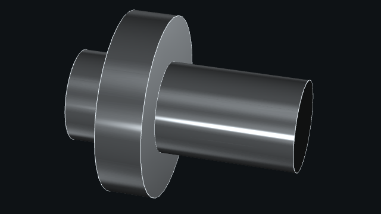

# Good practices

You should be aware of some good practices in `madcad` which may solve many issues.

Let's start with this example:
Imagine you want to make a revolution of a section. You start by defining the points of your section around the axis `(O, Z)`. Then you apply a revolution around the axis of your section:

```python
from madcad import *
points = [O, X, X + Z, 2 * X + Z, 2 * (X + Z), X + 2 * Z, X + 5 * Z, 5 * Z]
section = Wire(points)
rev = revolution(section)
show([section, rev.transform(translate(6 * X))])
```


You can observe the section on left side and the revolution on the right side. There are several problems that we are going to solve step by step:

## There is no visible edge on the revolution

By default, when the `Wire` is created, the set of points is defined as a *discretized curve* contained in only one *group* in its `groups`. To get different *groups*, we need to specify that the `Wire` is `segmented`:

```python
from madcad import *
points = [O, X, X + Z, 2 * X + Z, 2 * (X + Z), X + 2 * Z, X + 5 * Z, 5 * Z]
section = Wire(points).segmented()
rev = revolution(section)
show([section, rev.transform(translate(6 * X))])
```


!!! note
    A `Mesh` has necessary `edges` in order to display `faces`. Therefore visible edges are defined by `groups`.

## The surface is dark

A surface in `madcad` is oriented which means it has a bright side and a dark side. The dark side must always face the inside of the part while the bright side must always face the outside of the part. To solve this, we need to flip the order of indices in the revolution `rev` or the order of indices in the `section`:

```python
from madcad import *
points = [O, X, X + Z, 2 * X + Z, 2 * (X + Z), X + 2 * Z, X + 5 * Z, 5 * Z]
section = Wire(points).segmented().flip() # quicker on Wire because there are less points
rev = revolution(section) # or .flip() here
show([section, rev.transform(translate(6 * X))])
```



## Duplicated points

There are still remaining dark surfaces on the top and the bottom of the revolution. Many functions and methods in `madcad` cannot automatically know what you want and most of the time, there are duplicated points which cause error such as in `triangulation.triangulation` function. You have two options:

- `myobj.mergeclose()` which is the recommended option
- `myobj.finish()` which has more steps of computation but it could do a better finishing stage.

```python
from madcad import *
points = [O, X, X + Z, 2 * X + Z, 2 * (X + Z), X + 2 * Z, X + 5 * Z, 5 * Z]
section = Wire(points).segmented().flip()
rev = revolution(section)
rev.mergeclose()
show([rev])
```


## Qualify groups

You should also consider *qualifying* groups of your part when you are defining it. See the following examples:

```python
from madcad import *
depth = 20
exterior = Circle((O, Z), 10)
hole = Circle((O, Z), 5)
profile = web([exterior, web(hole).flip().qualify("hole")]) # qualify "hole" for future usage
result = (
    extrusion(profile, depth * Z)
    + flatsurface(profile)
    + flatsurface(profile.transform(depth * Z).flip())
)
show(
    [
        result,
        result.group("hole").transform(translate(16 * X)), # extract faces and edges (Mesh)
        result.frontiers("hole", None).transform(translate(27 * X)), # extract edges (Web)
    ]
)
```


The main idea is to be able to extract groups of your part without guessing their index. Without *qualifying* groups, you must inspect `groups` of your parts and test them one by one:

```python
from madcad import *
depth = 20
exterior = Circle((O, Z), 10)
hole = Circle((O, Z), 5)
profile = web([exterior, web(hole).flip()])
result = (
    extrusion(profile, depth * Z)
    + flatsurface(profile)
    + flatsurface(profile.transform(depth * Z).flip())
)
print(result.groups) # [None, None, None, None]
show(
    [
        result,
        result.group(1).transform(translate(16 * X)),
        result.frontiers(1, None).transform(translate(27 * X)),
    ]
)
```


It can be annoying when you have many `groups`.

The last point to extract information could be by selecting edges based on a direction. See the following example:

```python
from madcad import *
depth = 20
exterior = Circle((O, Z), 10)
hole = Circle((O, Z), 5)
profile = web([exterior, web(hole).flip()])
result = (
    extrusion(profile, depth * Z)
    + flatsurface(profile)
    + flatsurface(profile.transform(depth * Z).flip())
)
extraction_top = select(result, vec3(5, 0, 20)) # or vec3(0, 5, 20)
extraction_bottom = select(result, vec3(5, 0, 0)) # or vec3(0, 5, 0)
extraction = extraction_top + extraction_bottom
show([result, extraction.transform(translate(16 * X))])
```


But with this method, there are more computation and only edges are extracted.
