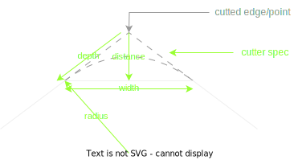
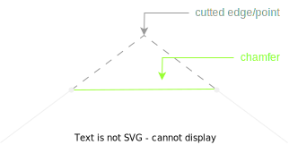
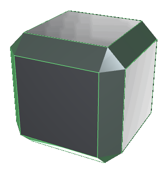
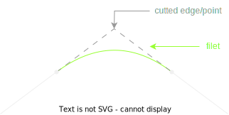
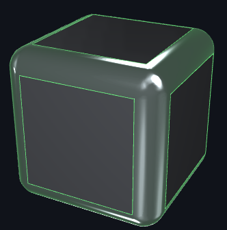
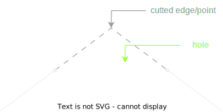
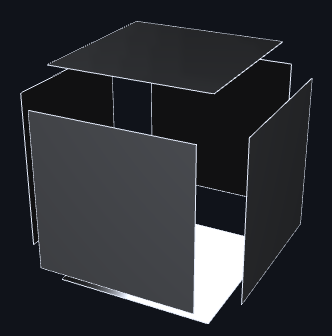

# bevel -- Functions for cutting meshes at edges or points, like chamfer

::: madcad.bevel
    options:
      show_root_heading: false
      members: false

## End-user functions

::: madcad.bevel.chamfer

::: madcad.bevel.filet

::: madcad.bevel.edgecut

## Cutters (cut methods)

::: madcad.bevel.cutter_width
::: madcad.bevel.cutter_distance
::: madcad.bevel.cutter_depth
::: madcad.bevel.cutter_radius
