# boolean -- Boolean cut/intersect/stitch meshes

::: madcad.boolean
    options:
      show_root_heading: false
      members: false

## Most common

::: madcad.boolean.pierce

Between `Web` (The result is the white part, the green part is the `ref` parameter)

```python
rect = web(
    wire([vec3(-w, -h, 0), vec3(w, -h, 0), vec3(w, h, 0), vec3(-w, h, 0)])
    .close()
    .segmented()
)
hole = web(Circle((O, Z), 1.5))

result = pierce(rect, hole)
```

<div class="grid" markdown>
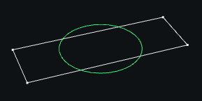
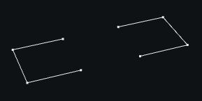
</div>

Between `Web` and `Mesh`:

```python
rect = web(
    wire([vec3(-w, -h, 0), vec3(w, -h, 0), vec3(w, h, 0), vec3(-w, h, 0)])
    .close()
    .segmented()
)
hole = extrusion(Circle((O, Z), 1.5), 4 * Z, alignment=0.5)

result = pierce(rect, hole)
```

<div class="grid" markdown>
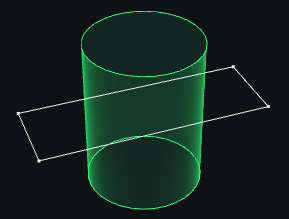
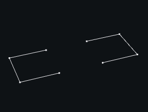
</div>

Between `Mesh`:

```python
rect = flatsurface(
    wire([vec3(-w, -h, 0), vec3(w, -h, 0), vec3(w, h, 0), vec3(-w, h, 0)])
)
rect = rect.transform(Z) + rect.transform(-Z).flip()
hole = extrusion(flatsurface(Circle((O, Z), 1.5)).flip(), 4 * Z, alignment=0.5)

result = pierce(rect, hole)
```

<div class="grid" markdown>

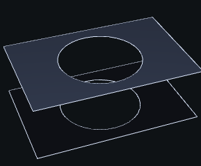
</div>

::: madcad.boolean.boolean

Between `Web`:

```python
w, h = 2, 1
a = web(
    wire([vec3(-w, -h, 0), vec3(w, -h, 0), vec3(w, h, 0), vec3(-w, h, 0)])
    .close()
    .segmented()
)
b = web(Circle((O, Z), 1.5))

result = boolean(a, b, (False, False))
```

<div class="grid" markdown>


</div>

Between `Mesh`:

```python
w, h = 3, 2
rect = flatsurface(
    wire([vec3(-w, -h, 0), vec3(w, -h, 0), vec3(w, h, 0), vec3(-w, h, 0)])
)
a = rect.transform(Z) + rect.transform(-Z).flip()
b = extrusion(flatsurface(Circle((O, Z), 1.5)).flip(), 4 * Z, alignment=0.5)

result = boolean(a, b, (False, False))
```

<div class="grid" markdown>

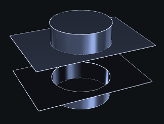
</div>

Those are shortcuts for `boolean`:

::: madcad.boolean.union

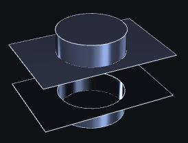

::: madcad.boolean.difference

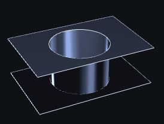

::: madcad.boolean.intersection

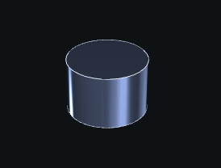

## More advanced

::: madcad.boolean.cut_web

<div class="grid" markdown>


</div>

::: madcad.boolean.cut_web_mesh

<div class="grid" markdown>
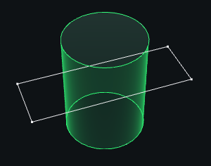
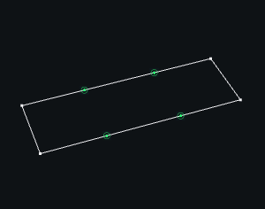
</div>

::: madcad.boolean.cut_mesh

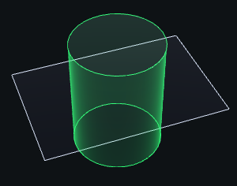

