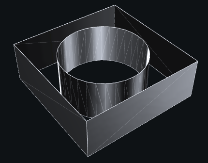

# Mesh -- mesh of triangles

::: madcad.Mesh
    options:
      members: false

Special methods

::: madcad.Mesh.__add__
::: madcad.Mesh.__iadd__

Data management

::: madcad.Mesh.own
::: madcad.Mesh.option
::: madcad.Mesh.transform
::: madcad.Mesh.mergeclose
::: madcad.Mesh.mergepoints
::: madcad.Mesh.mergegroups
::: madcad.Mesh.strippoints
::: madcad.Mesh.stripgroups
::: madcad.Mesh.finish

Verification methods

::: madcad.Mesh.check
::: madcad.Mesh.isvalid
::: madcad.Mesh.issurface
::: madcad.Mesh.isenvelope

Selection methods

::: madcad.Mesh.pointnear
::: madcad.Mesh.pointat
::: madcad.Mesh.groupnear
::: madcad.Mesh.facenear
::: madcad.Mesh.group
::: madcad.Mesh.replace
::: madcad.Mesh.qualify
::: madcad.Mesh.qualified_indices
::: madcad.Mesh.qualified_groups

Extraction methods

::: madcad.Mesh.maxnum
::: madcad.Mesh.precision
::: madcad.Mesh.surface
::: madcad.Mesh.volume
::: madcad.Mesh.barycenter
::: madcad.Mesh.barycenter_points
::: madcad.Mesh.box
::: madcad.Mesh.usepointat
::: madcad.Mesh.facepoints
::: madcad.Mesh.facenormal
::: madcad.Mesh.facenormals
::: madcad.Mesh.edgenormals
::: madcad.Mesh.vertexnormals
::: madcad.Mesh.tangents
::: madcad.Mesh.edges
::: madcad.Mesh.edges_oriented
::: madcad.Mesh.outlines
::: madcad.Mesh.outlines_oriented
::: madcad.Mesh.outlines_unoriented
::: madcad.Mesh.groupoutlines
::: madcad.Mesh.frontiers
::: madcad.Mesh.splitgroups
::: madcad.Mesh.split
::: madcad.Mesh.islands
::: madcad.Mesh.flip
::: madcad.Mesh.orient

