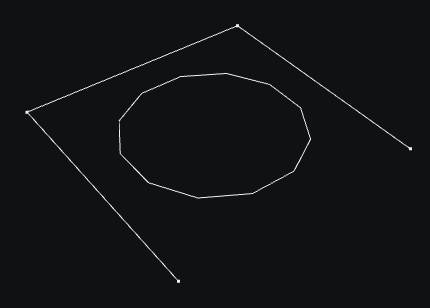

# Web -- mesh of edges

::: madcad.Web
    options:
      members: false

Special methods

::: madcad.Web.__add__
::: madcad.Web.__iadd__

Data management

::: madcad.Web.own
::: madcad.Web.option
::: madcad.Web.transform
::: madcad.Web.mergeclose
::: madcad.Web.mergepoints
::: madcad.Web.mergegroups
::: madcad.Web.strippoints
::: madcad.Web.stripgroups
::: madcad.Web.finish

Mesh checks

::: madcad.Web.check
::: madcad.Web.isvalid
::: madcad.Web.isline
::: madcad.Web.isloop

Selection methods

::: madcad.Web.pointnear
::: madcad.Web.pointat
::: madcad.Web.groupnear
::: madcad.Web.edgenear
::: madcad.Web.group
::: madcad.Web.replace
::: madcad.Web.qualify
::: madcad.Web.qualified_indices
::: madcad.Web.qualified_groups

Extraction methods

::: madcad.Web.maxnum
::: madcad.Web.precision
::: madcad.Web.length
::: madcad.Web.surface
::: madcad.Web.barycenter
::: madcad.Web.barycenter_points
::: madcad.Web.box
::: madcad.Web.usepointat
::: madcad.Web.edgepoints
::: madcad.Web.edgedirection
::: madcad.Web.extremities
::: madcad.Web.groupextremities
::: madcad.Web.frontiers
::: madcad.Web.arcs
::: madcad.Web.islands
::: madcad.Web.groupislands
::: madcad.Web.segmented
::: madcad.Web.flip

