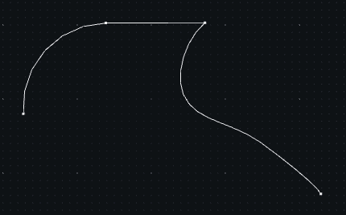

# Wire -- mesh of points, or suite of points

::: madcad.Wire
    options:
      members: false

Special methods

::: madcad.Wire.__add__
::: madcad.Wire.__iadd__
::: madcad.Wire.__len__
::: madcad.Wire.__iter__
::: madcad.Wire.__getitem__

Data management

::: madcad.Wire.own
::: madcad.Wire.option
::: madcad.Wire.transform
::: madcad.Wire.mergeclose
::: madcad.Wire.mergepoints
::: madcad.Wire.mergegroups
::: madcad.Wire.strippoints
::: madcad.Wire.stripgroups
::: madcad.Wire.finish

Mesh checks

::: madcad.Wire.check
::: madcad.Wire.isvalid

Selection methods

::: madcad.Wire.pointnear
::: madcad.Wire.pointat
::: madcad.Wire.groupnear
::: madcad.Wire.edgenear
::: madcad.Wire.group

Extraction methods

::: madcad.Wire.length
::: madcad.Wire.surface
::: madcad.Wire.barycenter
::: madcad.Wire.barycenter_points
::: madcad.Wire.box
::: madcad.Wire.normal
::: madcad.Wire.edgepoints
::: madcad.Wire.edgedirection
::: madcad.Wire.edge
::: madcad.Wire.edges
::: madcad.Wire.vertexnormals
::: madcad.Wire.tangents
::: madcad.Wire.flip
::: madcad.Wire.close
::: madcad.Wire.segmented

